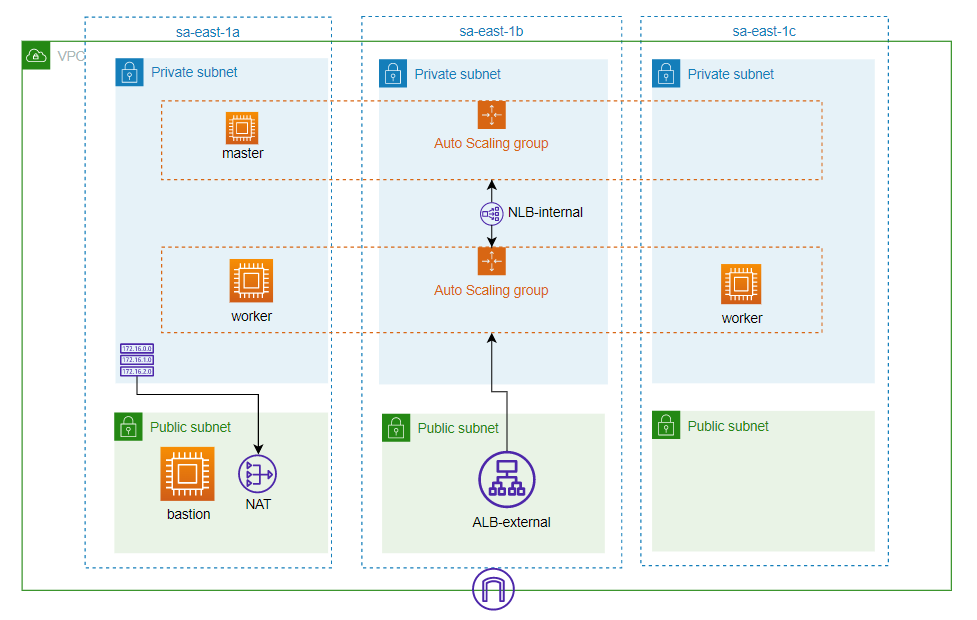

# Spot-instances K8S cluster

- This is a learning-purpose side project that follows along with kubernetes-the-hard-way tutorial, but instead of GKE and direct API usage, I used a Spot-instances fleet with Terraform as infrastructure provider.

- There are also networking configs, leveraging components such as VPCs, public/private subnets, route tables, ASGs, user-data and bastion hosts.

- This is a small simulation of EKS architecture.

## Architecture (actual)

## Modules
### Networking module
#### **Inputs**
| Variable | Description |
| ---------- | --------------------------- |
| region | Region in which the resources will be created. |
| access_key | Access key of the AWS user that will perform the actions of this repository. |
| secret_key | AWS user secret key |
| vpc_name | Name of your VPC |
| vpc_range | Full range of your VPC |
| private_subnets | Ranges and AZs of subnets that will be private. Must be in conformity with VPC range |
| public_subnets | Ranges and AZs of subnets that will be public. Must be in conformity with VPC range |
| bastion_username | user of your bastion. defaults to ec2-user |
| key_full_path | (TEMPORARY) full path of your key.pem |
| kube_port_api | kube server port. defaults to 6443 |

--- 
#### **Outputs**

Listing and describing the main outputs provided by the module.

| Output | Description |
| --------- | --------------------------- |
| bastion_ip | Bastion IP. it will be used in Bootstraping module... Soon.. |

### Bootstraping module
WIP .... 

## Side-notes / important
- Since the current repo is creating only one NAT Gateway, one of the instances in **ALB-external** will be marked as **UNHEALTHY**, since it can't access internet to download HTTPD server.
- Terraform will output an error  (not impactful) after creating all resources since one of our templates cannot be launched in AZ-B. But it won't impact anything since it will launch another instance in AZ-C.
- I fixed 1 Master instance and 2 Nodes instances in their ASGs, cause this project is limited to 3 instances only.